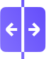
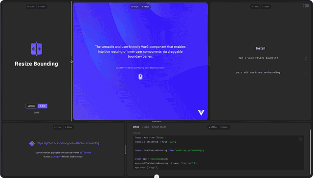

# Vue3 Resize Bounding  [](https://opensource.org/licenses/MIT)

**Vue3 Resize Bounding** is a simple, custom component for Vue 3 that allows you to intuitively resize nested components using draggable border panels. It easily increases interactivity and control.



[Demo](https://vue3-resize-bounding.netlify.app/)

> **Examples**
>
> - [Interactive Grid](https://github.com/yamogoo/vue3-resize-bounding/blob/main/packages/playground/vite-app/src/components/InteractiveGrid.vue)
> - [Overriding](https://github.com/yamogoo/vue3-resize-bounding/blob/main/packages/playground/vite-app/src/components/StylizedKnob.vue)

---

## Documentation

### Installation and Usage

Using npm:

```bash
npm i vue3-resize-bounding
```

Using yarn:

```bash
yarn add vue3-resize-bounding
```

### Setup

Register the component globally.

```ts
// @filename: main.ts
import App from "@/App";
import { createApp } from "vue";

import ResizeBounding from "vue3-resize-bounding";

const app = createApp(App);
app.use(ResizeBounding, { name: "resize-bounding" });
app.mount("#app");
```

### Usage

1. Use default styles (splitter only):

```html
<template>
  <resize-bounding
    :width="container.width"
    :height="container.height"
    :min-width="240"
    :max-width="480"
    :min-height="120"
    @update:width="(width) => (container.width = width)"
    @update:height="(height) => (container.height = height)"
  >
    <!-- CONTENT START -->
    <div style="width="100%; height: 100%;>My Container</div>
    <!-- CONTENT END -->
  </resize-bounding>
</template>

<script>
  import { ref } from "vue";
  const container = ref({ width: 320, height: 480 });
</script>
```

2. Simple knob styling:

```html
<template>
  <resize-bounding
    :width="container.width"
    :height="container.height"
    :min-width="240"
    :max-width="480"
    :min-height="120"
    :options="{ knob: { show: true } }"
    :styles="{ knob: { width: '10px' borderRadius: '5px'} }"
    @update:width="(width) => (container.width = width)"
    @update:height="(height) => (container.height = height)"
  >
    <!-- CONTENT START -->
    <div style="width="100%; height: 100%;>My Container</div>
    <!-- CONTENT END -->

    <!-- KNOB INNER CONTENT START -->
    <template #knob>
      <div class="some-icon"></div>
    </template>
    <!-- KNOB INNER CONTENT END -->
  </resize-bounding>
</template>

<script>
  import { ref } from "vue";
  const container = ref({ width: 320, height: 480 });
</script>
```

> **Touch Area**
> To increase the touch area, set the value to `options.activeAreaWidth` or use increased height of the `knob`

> **Styling/Overriding**
> Descriptions and examples of advanced overriding `options` and customization `styles` are described at the end of this documentation.

### Properties

<table class="table-fonts">
    <thead>
      <tr>
        <th>property</th>
        <th>type</th>
        <th>default value</th>
        <th colspan="2">description</th>
      </tr>
    </thead>
    <tbody>
      <tr>
        <td rowspan="9">
          <code><b>directions</b></code>
        </td>
        <td rowspan="9"><code>string</code></td>
        <td rowspan="9" align="center"><code>'hv'</code></td>
      </tr>
      <tr>
        <td colspan="2">
          The literal <code>'hv'</code> specifies which boundaries should be
          enabled for resizing.<br /><br />
          The order of the characters is not significant.
          <br />
          <sub><code>'hv'</code> is equivalent to <code>'tblr'</code></sub>
        </td>
      </tr>
      <th>value</th>
      <th>description</th>
      <tr>
        <td>'t'</td>
        <td>top</td>
      </tr>
      <tr>
        <td>'r'</td>
        <td>right</td>
      </tr>
      <tr>
        <td>'b'</td>
        <td>bottom</td>
      </tr>
      <tr>
        <td>'l'</td>
        <td>left</td>
      </tr>
      <tr>
        <td>'h'</td>
        <td>horizontal alias, equivalent to <code>'lr'</code></td>
      </tr>
      <tr>
        <td>'v'</td>
        <td>vertical alias, equivalent to <code>'tb'</code></td>
      </tr>
      <tr>
        <td>
          <code><b>disabled</b></code>
        </td>
        <td><code>boolean</code></td>
        <td align="center"><code>false</code></td>
        <td colspan="2">Disable border selection</td>
      </tr>
      <tr>
        <td>
          <code><b>width</b></code>
        </td>
        <td><code>number | undefined</code></td>
        <td align="center"><code>undefined</code></td>
        <td colspan="2">Set current container width</td>
      </tr>
      <tr>
        <td>
          <code><b>minWidth</b></code>
        </td>
        <td><code>number | undefined</code></td>
        <td align="center"><code>0</code></td>
        <td colspan="2">Minimum value of the width resizing range</td>
      </tr>
      <tr>
        <td>
          <code><b>maxWidth</b></code>
        </td>
        <td><code>number | undefined</code></td>
        <td align="center"><code>undefined</code></td>
        <td colspan="2">
          Maximum resizing range value. <code>undefiend</code>
          <br />
          <sub>Equivalent to <code>Number.POSITIVE_INFINITY</code></sub>
        </td>
      </tr>
      <tr>
        <td>
          <code><b>height</b></code>
        </td>
        <td><code>number | undefined</code></td>
        <td align="center"><code>0</code></td>
        <td colspan="2">Set current container height</td>
      </tr>
      <tr>
        <td>
          <code><b>minHeight</b></code>
        </td>
        <td><code>number | undefined</code></td>
        <td align="center"><code>0</code></td>
        <td colspan="2">Minimum height resizing range value</td>
      </tr>
      <tr>
        <td>
          <code><b>maxHeight</b></code>
        </td>
        <td><code>number | undefined</code></td>
        <td><code>undefined</code></td>
        <td colspan="2">
          The maximum value of the height resizing range.
          <br />
          <sub>Equivalent to <code>Number.POSITIVE_INFINITY</code></sub>
        </td>
      </tr>
      <tr>
        <th colspan="5">additional options</th>
      </tr>
      <tr>
        <th>property</th>
        <th>type</th>
        <th colspan="3">value</th>
      </tr>
      <tr>
        <td rowspan="45">
          <code><b>options</b></code>
        </td>
        <td rowspan="45">
          <code>Partial &#60;ResizeBounding.Options&#62;</code>
        </td>
      </tr>
      <tr>
        <td colspan="3">
          <b><code>options.prefix</code></b>
        </td>
      </tr>
      <tr>
        <td colspan="2">description</td>
        <td colspan="2">Overrides the default class names prefix</td>
      </tr>
      <tr>
        <td colspan="2">type</td>
        <td colspan="2"><code>string</code></td>
      </tr>
      <tr>
        <td colspan="2">default value</td>
        <td colspan="2">
          <code>'resize-bounding-'</code>
        </td>
      </tr>
      <!-- options.pane.width -->
      <tr>
        <td colspan="3">
          <b><code>options.width</code></b>
        </td>
      </tr>
      <tr>
        <td colspan="2">description</td>
        <td colspan="2">Set width of splitter in pixels</td>
      </tr>
      <tr>
        <td colspan="2">type</td>
        <td colspan="2"><code>number</code></td>
      </tr>
      <tr>
        <td colspan="2">default value</td>
        <td colspan="2">
          <code>4</code>
        </td>
      </tr>
      <tr>
        <td colspan="3">
          <b><code>options.activeAreaWidth</code></b>
        </td>
      </tr>
      <tr>
        <td colspan="2">description</td>
        <td colspan="2">Sets the width of the active space within which the border (splitter) selection will be activated</td>
      </tr>
      <tr>
        <td colspan="2">type</td>
        <td colspan="2"><code>number | undefined</code></td>
      </tr>
      <tr>
        <td colspan="2">default value</td>
        <td colspan="2">
          <code>undefined</code>
        </td>
      </tr>
      <!-- options.pane.position -->
      <tr>
        <td colspan="3">
          <code><b>options.position</b></code>
        </td>
      </tr>
      <tr>
        <td colspan="2">description</td>
        <td colspan="2">
          Determines the positioning of the splitter relative to the container
          boundaries
        </td>
      </tr>
      <tr>
        <td colspan="2">type</td>
        <td colspan="2"><code>PanePosition</code></td>
      </tr>
      <tr>
        <td colspan="2">default value</td>
        <td colspan="2">
          <code>'central'</code>
        </td>
      </tr>
      <tr>
        <td colspan="2" rowspan="4">values:</td>
      </tr>
      <tr>
        <td colspan="2">
          <code>'central'</code>
        </td>
      </tr>
      <tr>
        <td colspan="2">
          <code>'internal'</code>
        </td>
      </tr>
      <tr>
        <td colspan="2">
          <code>'external'</code>
        </td>
      </tr>
      <tr>
        <td colspan="3">
          <code><b>options.addStateClasses</b></code>
        </td>
      </tr>
      <tr>
        <td colspan="2">description</td>
        <td colspan="2">Add state classes to a pane element</td>
      </tr>
      <tr>
        <td colspan="2">type</td>
        <td colspan="2"><code>boolean</code></td>
      </tr>
      <tr>
        <td colspan="2">default value</td>
        <td colspan="2"><code>false</code></td>
      </tr>
      <tr>
        <td colspan="3">
          <code><b>options.touchActions</b></code>
        </td>
      </tr>
      <tr>
        <td colspan="2">description</td>
        <td colspan="2">Enable touch actions</td>
      </tr>
      <tr>
        <td colspan="2">type</td>
        <td colspan="2"><code>boolean</code></td>
      </tr>
      <tr>
        <td colspan="2">default value</td>
        <td colspan="2"><code>true</code></td>
      </tr>
      <tr>
        <td colspan="3">
          <code><b>options.knob.show</b></code>
        </td>
      </tr>
      <tr>
        <td colspan="2">description</td>
        <td colspan="2">Render the knob</td>
      </tr>
      <tr>
        <td colspan="2">type</td>
        <td colspan="2"><code>boolean</code></td>
      </tr>
      <tr>
        <td colspan="2">default value</td>
        <td colspan="2"><code>false</code></td>
      </tr>
      <tr>
        <td colspan="3">
          <code><b>options.knob.normalHidden</b></code>
        </td>
      </tr>
      <tr>
        <td colspan="2">description</td>
        <td colspan="2">
          Render the knob only when focusing or clicking on the splitter
        </td>
      </tr>
      <tr>
        <td colspan="2">type</td>
        <td colspan="2"><code>boolean</code></td>
      </tr>
      <tr>
        <td colspan="2">default value</td>
        <td colspan="2"><code>false</code></td>
      </tr>
      <tr>
        <td colspan="3">
          <code><b>options.cursor.vertical</b></code>
        </td>
      </tr>
      <tr>
        <td colspan="2">description</td>
        <td colspan="2">
          Cursor style for horizontal bounding during Focus and Resize
        </td>
      </tr>
      <tr>
        <td colspan="2">type</td>
        <td colspan="2"><code>CSSStyleDeclaration["cursor"]</code></td>
      </tr>
      <tr>
        <td colspan="2">default value</td>
        <td colspan="2"><code>'row-resize'</code></td>
      </tr>
      <tr>
        <td colspan="3">
          <b><code>options.cursor.horizontal</code></b>
        </td>
      </tr>
      <tr>
        <td colspan="2">description</td>
        <td colspan="2">
          Cursor style for vertical bounding during Focus and Resize
        </td>
      </tr>
      <tr>
        <td colspan="2">type</td>
        <td colspan="2"><code>CSSStyleDeclaration["cursor"]</code></td>
      </tr>
      <tr>
        <td colspan="2">default value</td>
        <td colspan="2"><code>'col-resize'</code></td>
      </tr>
      <!-- Styles -->
      <tr>
        <td rowspan="21">
          <code><b>styles</b></code>
        </td>
        <td rowspan="21">
          <code>ResizeBounding.IStyles</code>
        </td>
      </tr>
      <tr>
        <td colspan="3">
          <b><code>styles.container</code></b>
        </td>
      </tr>
      <tr>
        <td colspan="2">description</td>
        <td colspan="2">
          Describes custom styles the <code>container</code> element. <code>container</code> is the
          element directly in which the user content is located, forwarded
          through &#60;slot/&#62;.
        </td>
      </tr>
      <tr>
        <td colspan="2">type</td>
        <td colspan="2">
          <code>type IStyle = fluentui.IStyle</code>
        </td>
      </tr>
      <tr>
        <td colspan="2">default value</td>
        <td colspan="2">
          <pre><code>container: [
  globalClassNames(prefix).container,
  { 
      displayName: globalClassNames(prefix).container,
      position: "relative"
  },
],</code></pre>
        </td>
      </tr>
      <tr>
        <td colspan="3">
          <b><code>styles.pane</code></b>
        </td>
      </tr>
      <tr>
        <td colspan="2">description</td>
        <td colspan="2">
          Describes custom styles the <code>pane</code> element. The <code>pane</code> element is a
          container responsible for positioning the splitter. Therefore, treat
          this component as an empty container, since you may only need to style
          it in very rare cases.
          <sub
            >Pane receives <code>normal</code>, <code>focused</code> and
            <code>pressed</code> classes
          </sub>
        </td>
      </tr>
      <tr>
        <td colspan="2">type</td>
        <td colspan="2">
          <code>type IStyle = fluentui.IStyle</code>
        </td>
      </tr>
      <tr>
        <td colspan="2">default value</td>
        <td colspan="2">
          <pre><code>pane: [
  globalClassNames(prefix).pane,
  {
    displayName: globalClassNames(prefix).pane,
    position: "absolute",
    display: "block",
    zIndex: 9999,
    touchAction: "none",
  },
],</code></pre>
        </td>
      </tr>
      <tr>
        <td colspan="3">
          <b><code>styles.splitter</code></b>
        </td>
      </tr>
      <tr>
        <td colspan="2">description</td>
        <td colspan="2">
          Describes custom styles the <code>splitter</code> element. <code>splitter</code> is an element
          that displays a selected border line
        </td>
      </tr>
      <tr>
        <td colspan="2">type</td>
        <td colspan="2">
          <code>type IStyle = fluentui.IStyle</code>
        </td>
      </tr>
      <tr>
        <td colspan="2">default value</td>
        <td colspan="2">
          <pre><code>splitter: [
  globalClassNames(prefix).splitter,
  {
    displayName: globalClassNames(prefix).splitter,
    position: "absolute",
    zIndex: 9999,
    transition: "background 125ms ease-out",
    ":hover": {
      background: "cornflowerblue",
    },
  },
],</code></pre>
        </td>
      </tr>
      <tr>
        <td colspan="3">
          <b><code>styles.splitterContainer</code></b>
        </td>
      </tr>
      <tr>
        <td colspan="2">description</td>
        <td colspan="2">
          Describes custom styles the <code>splitterContainer</code> element. <code>splitterContainer</code> is empty element used to rotating the knob
        </td>
      </tr>
      <tr>
        <td colspan="2">type</td>
        <td colspan="2">
          <code>type IStyle = fluentui.IStyle</code>
        </td>
      </tr>
      <tr>
        <td colspan="2">default value</td>
        <td colspan="2">
          <pre><code>splitterContainer: [
  globalClassNames(prefix).splitterContainer,
  {
    displayName: globalClassNames(prefix).splitterContainer,
    position: "relative",
    display: "flex",
    alignItems: "center",
    justifyContent: "center",
    top: "50%",
    left: "50%",
    width: `0px`,
    height: `0px`,
  },
],</code></pre>
        </td>
      </tr>
      <tr>
        <td colspan="3">
          <b><code>styles.knob</code></b>
        </td>
      </tr>
      <tr>
        <td colspan="2">description</td>
        <td colspan="2">
          Describes custom styles the <code>knob</code> element. <code>Knob</code>is a decorative element
          located on top of the splitter. Convenient to use with touch actions,
          as it increases the touch area of ​​the splitter by its own size and
          has a positive effect on user experience
        </td>
      </tr>
      <tr>
        <td colspan="2">type</td>
        <td colspan="2">
          <code>type IStyle = fluentui.IStyle</code>
        </td>
      </tr>
      <tr>
        <td colspan="2">default value</td>
        <td colspan="2">
          <pre><code>knob: [ globalClassNames(prefix).knob,
  {
    displayName: globalClassNames(prefix).knob,
    position: "absolute",
    width: "64px",
    height: "8px",
    background: "gray",
    borderRadius: "4px",
    transition: "background 125ms ease-out",
    [`.${globalClassNames(prefix).pane} :hover &`]: {
      background: "cornflowerblue",
    },
  },
],</code></pre>

</td>
</tr>
</tbody>

  </table>

### Events

<table class="table-fonts">
  <thead>
    <tr>
      <th>property</th>
      <th style="width: 280px">type</th>
      <th colspan="2">description</th>
    </tr>
  </thead>
  <tbody>
    <tr>
      <td>
        <code><b>@update:width</b></code>
      </td>
      <td><code>(width: number) => void</code></td>
      <td colspan="2">Emitted every time a container width is updated</td>
    </tr>
    <tr>
      <td>
        <code><b>@update:height</b></code>
      </td>
      <td><code>(height: number) => void</code></td>
      <td colspan="2">Emitted every time a container height is updated</td>
    </tr>
    <tr>
      <td>
        <code><b>@drag:start</b></code>
      </td>
      <td><code>(direction: string) => void</code></td>
      <td colspan="2">
        Emitted when resizing starts. The callback function accepts an
        argument of current <code>direction</code>
      </td>
    </tr>
    <tr>
      <td>
        <code><b>@drag:move</b></code>
      </td>
      <td><code>(direction: string) => void</code></td>
      <td colspan="2">
        Emitted when resizing. The callback function accepts an argument of
        current <code>direction</code>
      </td>
    </tr>
    <tr>
      <td>
        <code><b>@drag:end</b></code>
      </td>
      <td><code>(direction: string) => void</code></td>
      <td colspan="2">
        Emitted when resizing ends. The callback function accepts an argument
        of current <code>direction</code>
      </td>
    </tr>
    <tr>
      <td>
        <code><b>@focus</b></code>
      </td>
      <td><code>({state: boolean, direction: string}) => void</code></td>
      <td colspan="2">Emitted when focusing on a specific boundary pane</td>
    </tr>
  </tbody>
</table>

---

### Customization

```html
<!-- MyResizeBoundingComponent.vue -->
<template>
  <resize-bounding v-bind="$attrs" :directions="'hv'" :options :styles>
    <slot></slot>
  </resize-bounding>
</template>

<script lang="ts">
  import ResizeBounding, { PREFIX } from "vue3-resize-bounding";

  /* * * Default styles and classes * * */

  const options = {
    width: 4,
    activeAreaWidth: undefined,
    position: "central", // 'central' | 'internal' | 'external'
    knob: {
      show: true,
      normalHidden: true,
    },
    cursor: {
      horizontal: "col-resize",
      vertical: "row-resize",
    },
    addStateClasses: false,
    touchActions: true,
  };

  const styles = {
    container: {
      displayName: `${PREFIX}container`,
      position: "relative",
    },
    pane: [
      `${PREFIX}pane`,
      {
        displayName: `${PREFIX}pane`,
        position: "absolute",
        display: "block",
        zIndex: 9999,
        touchAction: "none",
      },
    ],
    splitter: [
      `${PREFIX}splitter`,
      {
        displayName: `${PREFIX}splitter`,
        position: "absolute",
        zIndex: 9999,
        transition: "background 125ms ease-out",
        ":hover": {
          background: "cornflowerblue",
        },
      },
    ],
    splitterContainer: [
      `${PREFIX}splitter--container`,
      {
        displayName: `${PREFIX}splitter--container`,
        position: "relative",
        display: "flex",
        alignItems: "center",
        justifyContent: "center",
        top: "50%",
        left: "50%",
        width: "0px",
        height: "0px",
      },
    ],
    knob: [
      `${PREFIX}knob`,
      {
        displayName: `${PREFIX}knob`,
        position: "absolute",
        width: "64px",
        height: "8px",
        background: "gray",
        borderRadius: "8px",
        transition: "background 125ms ease-out",
        [`.${PREFIX}pane :hover &`]: {
          background: "cornflowerblue",
        },
      },
    ],
  };
</script>
```

---

Using `css` (preprocessors)

> Specify `:options="{ addStateClasses: true }"` to add state classes to the `pane` element

```html
<template>
  <resize-bounding
    :width="container.width"
    :height="container.height"
    :min-width="240"
    :max-width="480"
    :min-height="120"
    :options="{ addStateClasses: true, knob: { show: true } }"
    @update:width="(width) => (container.width = width)"
    @update:height="(height) => (container.height = height)"
  >
    <!-- CONTENT START -->
    <div style="width="100%; height: 100%;>My Container</div>
    <!-- CONTENT END -->

    <!-- KNOB INNER CONTENT START -->
    <template #knob>
      <div class="some-icon"></div>
    </template>
    <!-- KNOB INNER CONTENT END -->
  </resize-bounding>
</template>

<script>
  import { ref } from "vue";
  const container = ref({ width: 320, height: 480 });
</script>

<style lang="scss">
$prefix: "resize-bounding-";

.#{$prefix} {
  &-container {}
  &-pane {
    .#{$prefix}splitter {
      &--container {}
    }
    .#{$prefix}knob {}

    /* * * States: * * */

    &.normal {
      .#{$prefix}splitter {
        &--container {}
      }
      .#{$prefix}knob {}
    }

    &.focused {
      .#{$prefix}splitter {
        &--container {}
      }
      .#{$prefix}knob {}
    }

    &.pressed {
      .#{$prefix}splitter {
        &--container {}
      }
      .#{$prefix}knob {}
    }
  }
}
</style>
```

---

## Author

**Mikhail Grebennikov** - [yamogoo](https://github.com/yamogoo)

This project is licensed under the terms of the [MIT license](./LICENSE).

```

```
