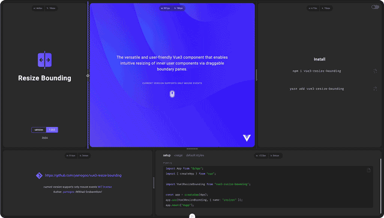

 [](https://opensource.org/licenses/MIT)

**React Resize Bounding** is a simple component that allows you to intuitively resize nested content using draggable border panels.

[Demo](https://resize-bounding.netlify.app/)


Examples:

- [Interactive Grid](https://github.com/yamogoo/resize-bounding/blob/main/packages/playground/vite-app/src/components/InteractiveGrid.tsx)
- [Overriding](https://github.com/yamogoo/resize-bounding/blob/main/packages/playground/vite-app/src/components/StylizedKnob.tsx)

Installation

```bash
npm i react-resize-bounding
# or
yarn add react-resize-bounding
```

Usage

```tsx
// @filename: MyComponent.tsx (.js)
import { useState } from "react";
import ResizeBounding from "react-resize-bounding";

export default function MyComponent() {
  const [width, setWidth] = useState(320);
  const [height, setHeight] = useState(480);

  return (
    <resize-bounding
      width={width}
      height={height}
      updateWidth={(width) => setWidth(width)}
      updateHeight={(height) => setHeight(height)}
      style={{ border: "1px solid gray" }}
    >
      {/* CONTENT START */}
      <div style={{ width: "100%", height: "100%" }}>My Container</div>
      {/* CONTENT END */}
    </resize-bounding>
  );
}
```

### Properties

<table class="table-fonts">
    <thead>
      <tr>
        <th>property</th>
        <th>type</th>
        <th>default value</th>
        <th colspan="2">description</th>
      </tr>
    </thead>
    <tbody>
      <tr>
        <td rowspan="9">
          <code><b>directions</b></code>
        </td>
        <td rowspan="9"><code>string</code></td>
        <td rowspan="9" align="center"><code>'hv'</code></td>
      </tr>
      <tr>
        <td colspan="2">
          The literal <code>'hv'</code> specifies which boundaries should be
          enabled for resizing.<br /><br />
          The order of the characters is not significant.
          <br />
          <sub><code>'hv'</code> is equivalent to <code>'tblr'</code></sub>
        </td>
      </tr>
      <th>value</th>
      <th>description</th>
      <tr>
        <td>'t'</td>
        <td>top</td>
      </tr>
      <tr>
        <td>'r'</td>
        <td>right</td>
      </tr>
      <tr>
        <td>'b'</td>
        <td>bottom</td>
      </tr>
      <tr>
        <td>'l'</td>
        <td>left</td>
      </tr>
      <tr>
        <td>'h'</td>
        <td>horizontal alias, equivalent to <code>'lr'</code></td>
      </tr>
      <tr>
        <td>'v'</td>
        <td>vertical alias, equivalent to <code>'tb'</code></td>
      </tr>
      <tr>
        <td>
          <code><b>disabled</b></code>
        </td>
        <td><code>boolean</code></td>
        <td align="center"><code>false</code></td>
        <td colspan="2">Disable border selection</td>
      </tr>
      <tr>
        <td>
          <code><b>width</b></code>
        </td>
        <td><code>number | undefined</code></td>
        <td align="center"><code>undefined</code></td>
        <td colspan="2">Set current container width</td>
      </tr>
      <tr>
        <td>
          <code><b>minWidth</b></code>
        </td>
        <td><code>number | undefined</code></td>
        <td align="center"><code>0</code></td>
        <td colspan="2">Minimum value of the width resizing range</td>
      </tr>
      <tr>
        <td>
          <code><b>maxWidth</b></code>
        </td>
        <td><code>number | undefined</code></td>
        <td align="center"><code>undefined</code></td>
        <td colspan="2">
          Maximum resizing range value. <code>undefiend</code>
          <br />
          <sub>Equivalent to <code>Number.POSITIVE_INFINITY</code></sub>
        </td>
      </tr>
      <tr>
        <td>
          <code><b>height</b></code>
        </td>
        <td><code>number | undefined</code></td>
        <td align="center"><code>undefined</code></td>
        <td colspan="2">Set current container height</td>
      </tr>
      <tr>
        <td>
          <code><b>minHeight</b></code>
        </td>
        <td><code>number | undefined</code></td>
        <td align="center"><code>0</code></td>
        <td colspan="2">Minimum height resizing range value</td>
      </tr>
      <tr>
        <td>
          <code><b>maxHeight</b></code>
        </td>
        <td><code>number | undefined</code></td>
        <td><code>undefined</code></td>
        <td colspan="2">
          The maximum value of the height resizing range.
          <br />
          <sub>Equivalent to <code>Number.POSITIVE_INFINITY</code></sub>
        </td>
      </tr>
      <tr>
        <th colspan="5">additional options</th>
      </tr>
      <tr>
        <th>property</th>
        <th>type</th>
        <th colspan="3">value</th>
      </tr>
      <tr>
        <td rowspan="41">
          <code><b>options</b></code>
        </td>
        <td rowspan="41">
          <code>Partial &#60;Options&#62;</code>
        </td>
      </tr>
      <tr>
        <td colspan="3">
          <b><code>options.prefix</code></b>
        </td>
      </tr>
      <tr>
        <td colspan="2">description</td>
        <td colspan="2">Overrides the default class names prefix</td>
      </tr>
      <tr>
        <td colspan="2">type</td>
        <td colspan="2"><code>string</code></td>
      </tr>
      <tr>
        <td colspan="2">default value</td>
        <td colspan="2">
          <code>'resize-bounding-'</code>
        </td>
      </tr>
      <!-- options.pane.width -->
      <tr>
        <td colspan="3">
          <b><code>options.width</code></b>
        </td>
      </tr>
      <tr>
        <td colspan="2">description</td>
        <td colspan="2">Set width of splitter in pixels</td>
      </tr>
      <tr>
        <td colspan="2">type</td>
        <td colspan="2"><code>number</code></td>
      </tr>
      <tr>
        <td colspan="2">default value</td>
        <td colspan="2">
          <code>4</code>
        </td>
      </tr>
      <tr>
        <td colspan="3">
          <b><code>options.activeAreaWidth</code></b>
        </td>
      </tr>
      <tr>
        <td colspan="2">description</td>
        <td colspan="2">Sets the width of the active space within which the border (splitter) selection will be activated</td>
      </tr>
      <tr>
        <td colspan="2">type</td>
        <td colspan="2"><code>number | undefined</code></td>
      </tr>
      <tr>
        <td colspan="2">default value</td>
        <td colspan="2">
          <code>undefined</code>
        </td>
      </tr>
      <!-- options.pane.position -->
      <tr>
        <td colspan="3">
          <code><b>options.position</b></code>
        </td>
      </tr>
      <tr>
        <td colspan="2">description</td>
        <td colspan="2">
          Determines the positioning of the splitter relative to the container
          boundaries
        </td>
      </tr>
      <tr>
        <td colspan="2">type</td>
        <td colspan="2"><code>PanePosition</code></td>
      </tr>
      <tr>
        <td colspan="2">default value</td>
        <td colspan="2">
          <code>'central'</code>
        </td>
      </tr>
      <tr>
        <td colspan="2" rowspan="4">values:</td>
      </tr>
      <tr>
        <td colspan="2">
          <code>'central'</code>
        </td>
      </tr>
      <tr>
        <td colspan="2">
          <code>'internal'</code>
        </td>
      </tr>
      <tr>
        <td colspan="2">
          <code>'external'</code>
        </td>
      </tr>
      <tr>
        <td colspan="3">
          <code><b>options.touchActions</b></code>
        </td>
      </tr>
      <tr>
        <td colspan="2">description</td>
        <td colspan="2">Enable touch actions</td>
      </tr>
      <tr>
        <td colspan="2">type</td>
        <td colspan="2"><code>boolean</code></td>
      </tr>
      <tr>
        <td colspan="2">default value</td>
        <td colspan="2"><code>true</code></td>
      </tr>
      <tr>
        <td colspan="3">
          <code><b>options.knob.show</b></code>
        </td>
      </tr>
      <tr>
        <td colspan="2">description</td>
        <td colspan="2">Render the knob</td>
      </tr>
      <tr>
        <td colspan="2">type</td>
        <td colspan="2"><code>boolean</code></td>
      </tr>
      <tr>
        <td colspan="2">default value</td>
        <td colspan="2"><code>false</code></td>
      </tr>
      <tr>
        <td colspan="3">
          <code><b>options.knob.normalHidden</b></code>
        </td>
      </tr>
      <tr>
        <td colspan="2">description</td>
        <td colspan="2">
          Render the knob only when focusing or pressing on the splitter
        </td>
      </tr>
      <tr>
        <td colspan="2">type</td>
        <td colspan="2"><code>boolean</code></td>
      </tr>
      <tr>
        <td colspan="2">default value</td>
        <td colspan="2"><code>false</code></td>
      </tr>
      <tr>
        <td colspan="3">
          <code><b>options.cursor.vertical</b></code>
        </td>
      </tr>
      <tr>
        <td colspan="2">description</td>
        <td colspan="2">
          Cursor style for horizontal bounding during Focus and Resize
        </td>
      </tr>
      <tr>
        <td colspan="2">type</td>
        <td colspan="2"><code>CSSStyleDeclaration["cursor"]</code></td>
      </tr>
      <tr>
        <td colspan="2">default value</td>
        <td colspan="2"><code>'row-resize'</code></td>
      </tr>
      <tr>
        <td colspan="3">
          <b><code>options.cursor.horizontal</code></b>
        </td>
      </tr>
      <tr>
        <td colspan="2">description</td>
        <td colspan="2">
          Cursor style for vertical bounding during Focus and Resize
        </td>
      </tr>
      <tr>
        <td colspan="2">type</td>
        <td colspan="2"><code>CSSStyleDeclaration["cursor"]</code></td>
      </tr>
      <tr>
        <td colspan="2">default value</td>
        <td colspan="2"><code>'col-resize'</code></td>
      </tr>
      <!-- Styles -->
      <tr>
        <td rowspan="21">
          <code><b>styles</b></code>
        </td>
        <td rowspan="21">
          <code>IStyles</code>
        </td>
      </tr>
      <tr>
        <td colspan="3">
          <b><code>styles.container</code></b>
        </td>
      </tr>
      <tr>
        <td colspan="2">description</td>
        <td colspan="2">
          Describes custom styles the <code>container</code> element. <code>container</code> is the
          element directly in which the user content is located, forwarded
          through &#60;slot/&#62;.
        </td>
      </tr>
      <tr>
        <td colspan="2">type</td>
        <td colspan="2">
          <code>type IStyle = fluentui.IStyle</code>
        </td>
      </tr>
      <tr>
        <td colspan="3">
          <b><code>styles.pane</code></b>
        </td>
      </tr>
      <tr>
        <td colspan="2">description</td>
        <td colspan="2">
          Describes custom styles the <code>pane</code> element. The <code>pane</code> element is a
          container responsible for positioning the splitter. Therefore, treat
          this component as an empty container, since you may only need to style
          it in very rare cases.
          <sub
            >Pane receives <code>normal</code>, <code>focused</code> and
            <code>pressed</code> classes
          </sub>
        </td>
      </tr>
      <tr>
        <td colspan="2">type</td>
        <td colspan="2">
          <code>type IStyle = fluentui.IStyle</code>
        </td>
      </tr>
      <tr>
        <td colspan="3">
          <b><code>styles.splitter</code></b>
        </td>
      </tr>
      <tr>
        <td colspan="2">description</td>
        <td colspan="2">
          Describes custom styles the <code>splitter</code> element. <code>splitter</code> is an element
          that displays a selected border line
        </td>
      </tr>
      <tr>
        <td colspan="2">type</td>
        <td colspan="2">
          <code>type IStyle = fluentui.IStyle</code>
        </td>
      </tr>
      <tr>
        <td colspan="3">
          <b><code>styles.splitterContainer</code></b>
        </td>
      </tr>
      <tr>
        <td colspan="2">description</td>
        <td colspan="2">
          Describes custom styles the <code>splitterContainer</code> element. <code>splitterContainer</code> is empty element used to rotating the knob
        </td>
      </tr>
      <tr>
        <td colspan="2">type</td>
        <td colspan="2">
          <code>type IStyle = fluentui.IStyle</code>
        </td>
      </tr>
      <tr>
        <td colspan="3">
          <b><code>styles.knob</code></b>
        </td>
      </tr>
      <tr>
        <td colspan="2">description</td>
        <td colspan="2">
          Describes custom styles the <code>knob</code> element. <code>Knob</code>is a decorative element
          located on top of the splitter. Convenient to use with touch actions,
          as it increases the touch area of ​​the splitter by its own size and
          has a positive effect on user experience
        </td>
      </tr>
      <tr>
        <td colspan="2">type</td>
        <td colspan="2">
          <code>type IStyle = fluentui.IStyle</code>
        </td>
      </tr>
</tbody>

  </table>

### Events

<table class="table-fonts">
  <thead>
    <tr>
      <th>property</th>
      <th style="width: 280px">type</th>
      <th colspan="2">description</th>
    </tr>
  </thead>
  <tbody>
    <tr>
      <td>
        <code><b>updateWidth</b></code>
      </td>
      <td><code>(width: number) => void</code></td>
      <td colspan="2">Emitted every time a container width is updated</td>
    </tr>
    <tr>
      <td>
        <code><b>updateHeight</b></code>
      </td>
      <td><code>(height: number) => void</code></td>
      <td colspan="2">Emitted every time a container height is updated</td>
    </tr>
    <tr>
      <td>
        <code><b>dragStart</b></code>
      </td>
      <td><code>(direction: string) => void</code></td>
      <td colspan="2">
        Emitted when resizing starts. The callback function accepts an
        argument of current <code>direction</code>
      </td>
    </tr>
    <tr>
      <td>
        <code><b>dragMove</b></code>
      </td>
      <td><code>(direction: string) => void</code></td>
      <td colspan="2">
        Emitted when resizing. The callback function accepts an argument of
        current <code>direction</code>
      </td>
    </tr>
    <tr>
      <td>
        <code><b>dragEnd</b></code>
      </td>
      <td><code>(direction: string) => void</code></td>
      <td colspan="2">
        Emitted when resizing ends. The callback function accepts an argument
        of current <code>direction</code>
      </td>
    </tr>
    <tr>
      <td>
        <code><b>focus</b></code>
      </td>
      <td><code>({state: boolean, direction: string}) => void</code></td>
      <td colspan="2">Emitted when focusing on a specific boundary pane</td>
    </tr>
  </tbody>
</table>

---

### Customization

```html
<!-- MyResizeBoundingComponent.vue -->
<template>
  <resize-bounding :directions="'h'" :options :styles>
    <slot></slot>
  </resize-bounding>
</template>

<script lang="ts">
  import ResizeBounding, { PREFIX } from "vue3-resize-bounding";

  /* * * Default styles and classes * * */

  const options = {
    width: 4,
    activeAreaWidth: undefined,
    position: "central", // 'central' | 'internal' | 'external'
    knob: {
      show: true,
      normalHidden: true,
    },
    cursor: {
      horizontal: "col-resize",
    },
    touchActions: true,
  };

  // Ниже приведены все дефолтные стили сугубо для демонстрации
  // В действительности можно переопределять только необходимые свойства
  const styles = (prefix: string): IStyles => ({
    container: [
      globalClassNames(prefix).container,
      { displayName: globalClassNames(prefix).container, position: "relative" },
    ],
    pane: [
      globalClassNames(prefix).pane,
      {
        displayName: globalClassNames(prefix).pane,
        position: "absolute",
        display: "block",
        zIndex: 9999,
        touchAction: "none",
      },
    ],
    splitter: [
      globalClassNames(prefix).splitter,
      {
        displayName: globalClassNames(prefix).splitter,
        position: "absolute",
        zIndex: 9999,
        transition: "background 125ms ease-out",
        // splitter focused/pressed state:
        [`.${globalClassNames(prefix).pane}.focused &,
          .${globalClassNames(prefix).pane}.pressed &`]: {
          background: "cornflowerblue",
        },
      },
    ],
    splitterContainer: [
      globalClassNames(prefix).splitterContainer,
      {
        displayName: globalClassNames(prefix).splitterContainer,
        position: "relative",
        top: "50%",
        left: "50%",
        width: `0px`,
        height: `0px`,
      },
    ],
    knob: [
      globalClassNames(prefix).knob,
      {
        displayName: globalClassNames(prefix).knob,
        position: "relative",
        width: "64px",
        height: "8px",
        background: "gray",
        borderRadius: "4px",
        transform: "translate(-50%, -50%)",
        transition: "background 125ms ease-out",
        // knob focused/pressed state:
        [`.${globalClassNames(prefix).pane}.focused &,
          .${globalClassNames(prefix).pane}.pressed &`]: {
          background: "cornflowerblue",
        },
      },
    ],
  });
</script>
```

> **Touch Area**
> To increase the touch area, set the value to `options.activeAreaWidth` or use increased height of the `knob`
> Default value is undefined

---

Using `css` (preprocessors)

```html
<template>
  <resize-bounding
    :width="container.width"
    :height="container.height"
    :min-width="240"
    :max-width="480"
    :min-height="120"
    :options="{ knob: { show: true } }"
    @update:width="(width) => (container.width = width)"
    @update:height="(height) => (container.height = height)"
  >
    <!-- CONTENT START -->
    <div style="width="100%; height: 100%;>My Container</div>
    <!-- CONTENT END -->

    <!-- KNOB INNER CONTENT START -->
    <template #knob>
      <div class="some-icon"></div>
    </template>
    <!-- KNOB INNER CONTENT END -->
  </resize-bounding>
</template>

<script>
  import { ref } from "vue";
  const container = ref({ width: 320, height: 480 });
</script>
```

```scss
// @filename: MyComponent.scss

$prefix: "resize-bounding-";

.#{$prefix} {
  &-container {
  }
  &-pane {
    .#{$prefix}splitter {
      /* &--container {} */
    }
    .#{$prefix}knob {
    }

    /* * * States: * * */

    &.normal {
      .#{$prefix}splitter {
        /* &--container {} */
      }
      .#{$prefix}knob {
      }
    }

    &.focused {
      .#{$prefix}splitter {
        /* &--container {} */
      }
      .#{$prefix}knob {
      }
    }

    &.pressed {
      .#{$prefix}splitter {
        /* &--container {} */
      }
      .#{$prefix}knob {
      }
    }
  }
}
```

---

## Author

**Mikhail Grebennikov** - [yamogoo](https://github.com/yamogoo)

This project is licensed under the terms of the [MIT license](./LICENSE).
